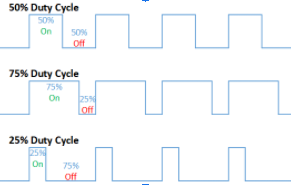
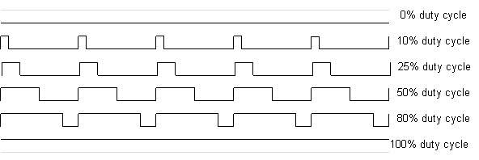

# Arduino Syntax

## General Coding Structure

*Anything listed under here is general coding structure that are found in many different coding languages, including Java, C, C++, and Python*

### For-loop structure

The for-loop structure repeats a set amount of code a certain number of times.

General syntax:

```cpp
for (initialization; condition; increment) {
    // statement(s);
}
```

This structure is useful for when you want to have a large amount of repetition in code. `cpp for (int number = 100; number > 100; number -= 1) { Serial.println("hi"); }` Initialization can be any variable or `number`. For instance, the variable number can be any other name, like `i` or `counter` or `abc`. Condition is a statement condition, think back to if statement conditions. Increments are the code that runs if the condition is true.

### If statement structure (conditional statements)

General Syntax:

```cpp
if (condition) {
    //statement(s)
}
```

The condition is something that can either be `true` or `false`, called a boolean expression (boolean = 2 outcomes).

Examples:

* `x > 120`
* `x <= y`
* `(x + 2) / 4 == 12`

Conditional operators are used to compare the condition to see if it is `true` or `false`.

```cpp
x == y  // (x is equal to y)
x != y  // (x is not equal to y)
x < y   // (x is less than y)
x > y   // (x is greater than y)
x <= y  // (x is less than or equal to y)
x >= y  // (x is greater than or equal to y)
```.

Example:

```cpp
if (x > 120) {
    digitalWrite(LEDpin1, HIGH);
    digitalWrite(LEDpin2, HIGH);
}
```

If `(x > 120)` is true LEDpin1 and LEDpin2 will be set to 5v (HIGH). If `(x > 120)` is NOT true, this statement will be skipped and it will move on to the rest of the code.

## Basics

### `setup()`

You can use this get your code started. It runs only once when you upload new code to it, and you can put functions like `pinMode()` in it.

 Example + what’s happening:

```cpp
void setup()
{
    pinMode(13, OUTPUT);
    pinMode(12, INPUT);
}
```

Digital pin #13 is set as OUTPUT, digital pin set #12 as INPUT.

### `loop()`

You can use this after you run `setup()`. It runs through the code inside of loop() from the top to bottom, and then goes back to the top to bottom… you get the idea

Example:

``` cpp
void loop()
{
    digitalWrite(13, HIGH);
    delay(1000); // Wait for 1000 millisecond(s)
    digitalWrite(13, LOW);
    delay(1000); // Wait for 1000 millisecond(s)
}
```

This code is the famous "blinking LED" code. It will turn the LED on and turn it off. Once it hits the bottom of the code, it’ll go back to the top and repeat.

`#include` can be used when you want to include outside libraries. Use `#include <LibraryFile.h>`. Don’t include a semicolon after the command, and make sure you put it at the very top of the code!
  
### Commonly Used Arduino Functions

* `pinMode(pin, mode)`
    * Pin = 0,1,2,3 etc (for analog pins, put an `A` in front of the pin number
    * Mode = INPUT, OUTPUT
    * Tells the specified pin to be either INPUT or OUTPUT mode
    * Used in `setup()`
    * Example:
    ``` cpp
    pinMode(A2, INPUT);
    pinMode(A4, OUTPUT);
    pinMode(13, OUTPUT);
    ```
    * Setting Analog Pin 2 to INPUT
    * Setting Analog Pin 4 to OUTPUT
    * Setting Analog Pin 13 to OUTPUT

* `digitalWrite(pin, value)`
    * Value = HIGH, LOW
    * Tells a specified pin to be HIGH or LOW
    * HIGH outputs a voltage of 5V or 3.3V, and LOW outputs 0V (ground)
    * For `digitalWrite()` to work, the specified pin must be set to OUTPUT mode using `pinMode()`
    * Example:
    ``` cpp
    digitalWrite(13, HIGH);
    delay(1000); // Wait for 1000 millisecond(s)
    digitalWrite(13, LOW);
    delay(1000); // Wait for 1000 millisecond(s)
    ```
    * Setting digital pin 13 to output a 5V voltage (HIGH) for 1k milliseconds
    * Setting digital pin 13 to output a 0V (no voltage, LOW) for 1k milliseconds

* `digitalRead(pin)`
    * Read the voltage of the specified pin; either HIGH or LOW
    * When you code
        * HIGH means that digitalRead will output 1
        * LOW means that digitalRead will output 0
    * For digitalRead to work, you guessed it, the specified pin must be set to INPUT mode using `pinMode()`
    * Example:
    ```cpp
    if (digitalRead(1) == 0);
    {
        digitalWrite(13, LOW);
        // There is no voltage or LOW state
        // on digital pin 1
    }
    if (digitalRead(1) == 1);
    {
        digitalWrite(13, HIGH);
        // There is 5V or HIGH state
        // on digital pin 1
    }
    ```
    * If there is no voltage on digital pin 1, then set pin 13 to LOW
    * If there is voltage on digital pin 1, then set pin 13 to HIGH

* `analogWrite(pin, value)`
    * Value = any value between 0 and 255
        * 0 = 0% on, or 100% off
        * 127 = 50% on, 50% off
    * Tells the specified pin to change the duty cycle
    * For `AnalogRead()` to work, the specified analog pin must be set to OUTPUT mode using `pinMode()`
        * Digital pins with a `~` besides their number can work as analog pins as well
    * Example:

        

* `analogRead(pin)`
    * Pin = the analog pin number you want to read
    * Will output an integer from 0 to 1023
    * Put an `A` before the pin number (ex: `A0`, `A2`) to specify an analog pin
    * Example:
    ```cpp
    ledBrightness = analogRead(A5) / 4;
    analogWrite(3, ledBrightness);
    ```
* `Serial.begin(baud rate)`
    * The baud rate is a common wavelength measure used by many devices for communication
    * For Arduino, our baud rate is 9600
    ```cpp
    void setup()
    {
        Serial.begin(9600);
    }
    ```
    * Use this line of code to start up the serial monitor, which is used when you want to print out lines of text

* `Serial.print(message)` and `Serial.println(message)`
    * In between the () you put a message you would like to print out inside of a pair of quotation marks
    ```cpp
    Serial.print(inches);
    Serial.print("in, ");
    Serial.print(cm);
    Serial.println("cm");
    ```
    * Prints out the message to the Serial monitor, useful for when you want to say something

* `delay(milliseconds)`
    * Pauses the execution of further code for a certain milliseconds
    * 1000 milliseconds = 1 second
    * Example:
    ```cpp
    digitalWrite(ledPin, HIGH); // sets the LED on
    delay(1000); // waits for a second
    digitalWrite(ledPin, LOW); // sets the LED off
    delay(1000); // waits for a second
    ```
    * Sets ledPin to 5v (HIGH)
    * Pauses execution of further code for 1000 milliseconds (keeps ledPin HIGH for 1 second)
    * Sets ledPin to 0v (LOW)
    * Pauses execution of further code for 1000 milliseconds (keeps ledPin LOW for 1 second)

## Servo Methods

Disclaimer: to use these Servo method, you must import the Servo library using #include at the beginning of of your code.
To use a Servo, you must declare a variable with a name (myServo) for example with the “Servo” type. Your servo name goes before .<method>; for example, if your Servo is called myBestServo, the attach method would be: myBestServo.attach(pin). Our servo in this documentation is called myServo.

### `myServo.attach(pin)`

Pin means pin# servo is attached to which is similar to `pinMode()` but for servo motors. It Lets the arduino know that on the specified pin, there is a servo connected. Pin must be a PWM pin (refer to `analogWrite()` for info on PWM pins). An example is:

```cpp
#include <Servo.h>
Servo myServo;

void setup (){
    myServo.attach(9);
}
```

This creates a Servo type variable called myServo and attaches myServo to pin 9.

### `myServo.write(angle)`

Angle is a degree angle between 0 - 180 which moves the servo shaft to that angle.
An example is:

```cpp
void loop(){
    myServo.write(90);
    myServo.write(0);
}
```

This moves the servo shaft to 90 degrees position and moves the servo shaft back to 0 degrees position.

### Miscellaneous Information

## Duty Cycle





Duty Cycle includes: how often the power is ON and OFF and the digital way of simulating an analog wave. For example, when you light an led with 50% duty cycle, it will appear 50% brightness to the human eye.
