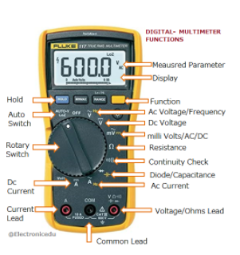
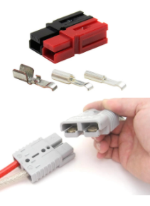
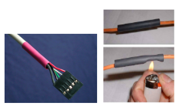

# Electronics Tools Documentation

### Tools

#### Wire Stripper
* Used to strip the wires of the outer plastic insulator 
* Steps
    * Find the gauge of the wire and place the wire into the appropriate groove
     * Squeeze like a scissor and pull on the wire to remove the plastic insulation
    * If you’re having trouble removing the plastic, try going down one gauge and try again
* [Specific instructions](https://www.youtube.com/watch?v=fDo-KbKRd4A)

#### Soldering Iron
* Used to join two or more items together with solder (melted metal)
* Steps
    * Heat up the soldering iron and obtain some solder
    * Carefully use the heated tip of the soldering iron to melt some solder onto the desired area of choice (ex: on two wires to join them together)
    * Make sure that the solder forms a solid connection, **don’t use too much solder**
    * If desired, cover up the soldered area with heat shrink or electrical tape
 * [Specific instructions](https://www.youtube.com/watch?v=Qps9woUGkvI)

#### Crimper
* Used to combine a connector and a wire together through compression
* Place the stripped ends of the wires you would like to connect inside of the connector
* Find the gauge of the connector and place it into the appropriate groove
* Squeeze like a scissor
* [Specific instructions](https://youtu.be/Svja8zEcKNQ?t=73)

#### Hammer Crimp Tool
* Used to join a metal crimp with a wire
    * Place metal crimp along with the wire inside of the crimp in the bottom “valley” of the tool
    * Start hammering on top of the tool, smushing the metal and creating a solid connection on the wire
    * Make sure to hammer down the whole crimp, it should look uniform when done

#### Multimeter
* Used to measure various values such as voltage, current, and resistance
    * Contains the physical multimeter and 2 probes
    * Note: We only use the DC voltage and resistance values
* How to use:
    * Turn the dial to what value you want to measure, and then plug the cables into the correct holes at the bottom of the multimeter
        * Note: you will always plug a cable into the middle hole, but there are different holes for measuring current/voltage/ohms
    * Put the probes on what you want to measure, make sure you match the ground and positive values correctly on what you are measuring

#### Battery Beak
* Used to check various stats of the battery, including internal resistance, charge %, and general status 
* Make sure that batteries for competition pass these criteria:
    * Resistance (“Rint”) must to be <0.2; ideally, competition grade batteries 
        * Should be around 0.10-0.19
    * “Status” must be “Good” (obv)
    * If charge is not over 100% (ideally 120%, which is the max), make sure to charge them before any competition matches
* For testing the robot and such, you don’t need the full 120% charge.
* For testing, make sure to use crappy batteries that have too high of an internal resistance that they’re not good for comp
* Specific instructions: *Video coming after we get back to the makerspace*

#### Heat Gun
* A very hot hair dryer used to shrink the heat shrink tubing
* Make sure that there are no flammable objects nearby the heat gun when in use

### Utilities

#### Zip Ties
* Ties that zip. Zips that tie.
* Can come in multiple lengths and sizes
* For use when needing a quick way to join objects together
* When the zip ties are too short, you can connect multiple zip ties together to create a “zip tie chain”

#### PWM Cables
* (Pulse Width Modulation)
* Sends signals to microcontrollers with different pulse lengths
* Used to connect certain sensors to the roboRIO (RIO has a couple of PWM ports)

#### CAN Wires
* Controller Area Network
* llows microcontrollers to communicate with each without a computer (roboRIO).
* Used to connect RoboRIO, PCM, speed controllers, PDP

#### Anderson Connectors (mini and regular)
* Used to connect wires to one other through small insulated housings
* Can also be used as the connecting plug from the battery to the robot
    * Place the stripped ends of the wires you would like to connect in the metal Anderson contact
    * Crimp the wire to the contact securely for good circuit connection
    * Fit/slide the wire and metal contact into the connector housing 
* [Specific instructions](https://www.youtube.com/watch?v=QzLvdR6X81k)

#### Electrical Tape 
* Used to cover/insulate exposed wires
    * Patches up and secures small wire-connected areas
* General all-purpose use
* Tip: you can color code the positive and ground with red and black tape :D

#### Heat Shrink Tubing
* This tubing is a useful alternative to electrical tape
* Once heated up, the tubing shrinks around the wire and provides insulation and some protection from the environment 
* There’s different diameters of tubing, so make sure to choose the  correct size for different wire gauges 

