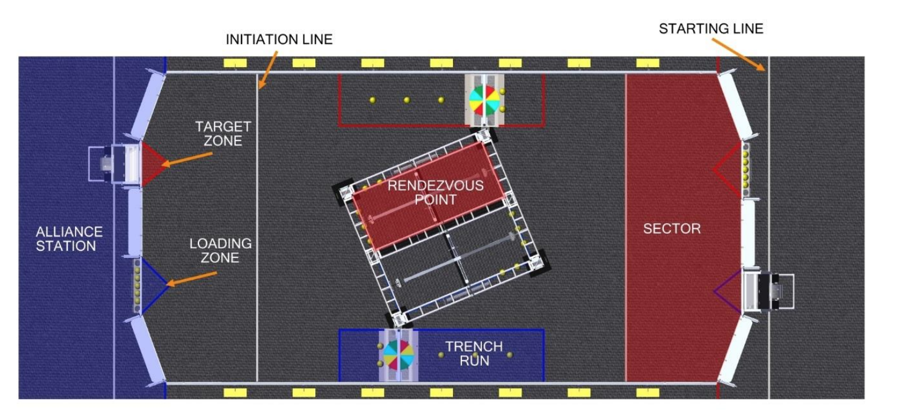
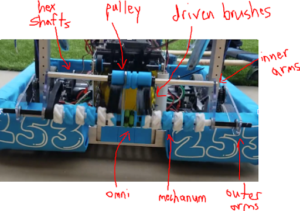
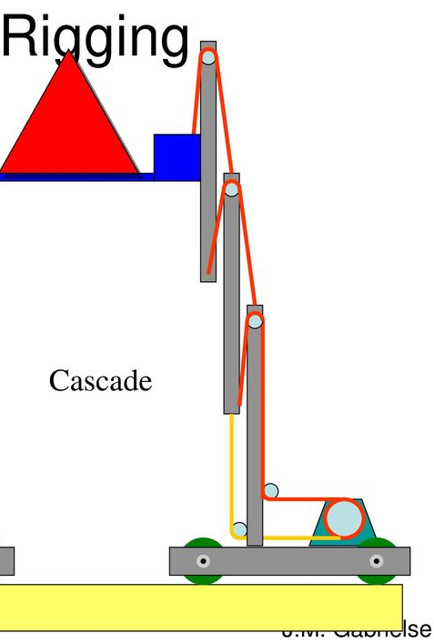
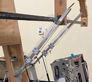

# 2020 Robot Overview (Tea3PO)

## Design Priorities

### Goal

Make it to playoffs at a regional level.

### Expected Capabilities

Here are **our expected capabilities** for alliance robots during the playoffs.
Our robot is designed around being a first pick.

<!-- This table is really ugly, sorry. -->

| Ability | Top 4 Alliance Captain | First Pick | Second Pick |
| ------- | ---------------------- | ---------- | ----------- |
| Climbing | Climb power switch with leveling/even out capability/buddy climb | Climb power switch and stay there | Climb power switch and stay there |
| Spin/Rotational Control | Spin control panel with both positional and rotational control | Spin control panel with rotational control | |
| Scoring Consistency | Score high goal nearly every time | Score high goal consistently | Play defense or score on low goal |
| Scoring Quantity | Score three or more balls in high goal during autonomous period | Score three balls in high goal during autonomous period | Score on low goal during autonomous | |
| Number of Balls Stored | Pick up and store five balls at a time | Pick up and store five balls at a time | |
| Floor Intake | Intake balls from the floor | Intake balls from the floor | |
| Passable Through Trench | Be able to go through the trench | Preferably go through trench | |

### Tea3PO's Design

#### Climbing Mechanism

The climbing mechanism is a **top priority** for our robot.

- The endgame **climb** is the highest single-action scoring opportunity in a match.
- To get the endgame **ranking point**, each alliance needs a minimum of **two robots** hanging on the shield generator.

#### No Control Panel Mechanism

A spinner mechanism for the Control Panel was of **low** priority

- only beneficial for gaining RP, which isn’t important in playoffs.
- focused more on designing the shooter

#### High Goal Shooter

We chose to design a shooter mechanism that could score **high-goal** as quickly as possible.

- Rule G11 in Section 7.2.3 of the 2020 game manual states that **any robot within it’s target scoring zone is protected from other robots**.
- Because of this rule we decided to create a shooter optimized for shooting within the **target zone**.

??? video "One of our prototype shooters"
    <iframe src="" allowfullscreen></iframe>

#### Autonomous Shooting

We decided that it was extremely valuable to take advantage of the **autonomous double point scoring period**.

 - At the start of each match, each robot can hold up to **three** balls.

#### Ground Intake

Initially, we put a ground intake as a lower priority, but later in the season it was determined that a ground intake gave us significant strategic advantages.

- would allow us to intake balls anywhere on the field.

## Mechanisms of the Robot

### Drivetrain

#### Chassis and Wheel

The robot has a 31" x 28" West Coast drive base with six 6" VEXpro traction wheels.

- 6" wheels give us sufficient ground clearance over the 1" metal tubes in the rendezvous point
- We added a 1/16" **center drop** to decrease the skid in our front and back wheels to allow for **smoother pivoting**.
- To reduce the distance that the power cells have to travel while maintaining chassis stability, we cut a **7" section on our front rail** that allows for power cells to pass into the robot.

The cut allows for power cells to be taken into the robot while still **maintaining contact** with either the **ground intake** and **conveyor belt** at all times without having an **open chassis** (shown below).

=== " "
    {: align=left}
    Unlike closed chassis bots, open chassis bots do not require a ball to be raised above the **front chassis frame**.

#### Drive Gearboxes

Each side of the drivetrain is driven by a **WCP SS gearbox with two falcon 550 motors** geared at a **10.42-1 ratio**.
This helps achieve the robot’s max speed of **around 13 ft/s**.

### Shooter

#### Prototypes

We had two main prototypes: a **hooded shooter** and a **linear shooter**.

- The **linear** shooter used two wheels on each side, and created relatively consistent and accurate shots. The **hooded** shooter also resulted in similar results.
- Both proved to have enough power to achieve the goals that we had set.

We decided to go with the **hooded shooter**, as the hood **increased the number of contact points** between the mechanism and the power cell.

We were concerned that any **variation** on the power cells, such as a tear or hole in the power cell, could drastically **decrease the accuracy** of our shots.

#### Final Design

The final shooter design consists of...

- two **¼" thick polycarbonate rails** with arcs
    - 3D printed hood attaches to the rails to control the release angle and follow the contour of the shooter wheel
- a 3lb **Neoprene drive roller** (shooter wheel)
    - driven by **2 NEO motors** at a **1:1 ratio**

??? video "Shooting Demonstration"
    <iframe src="" allowfullscreen></iframe>

### Accumulator

#### Prototypes

Hopper vs Conveyor vs Ramp

##### The Ramp

We tested a **shallow, gravity driven ramp**, but decided that the speed at which the power cells feed into the shooter would be **slower than we wanted**.

##### The Hopper

Concerns about the hopper’s potential to jam balls led to the conveyor being chosen over it.

##### The Conveyor (Chosen!)

We built a wooden prototype of the conveyor, but found that the **single NEO brushless motor wasn’t powerful enough** to move the power cells through the system, so we settled for a two motor system.

#### Final Design: Conveyer

The final design is a conveyor that files power cells one by one. The conveyer is broken into two **separate sections** and has an **"L" shape**. Each section has a single **NEO** motor geared similarly to the shooter to minimize energy transfer between the shooter and the balls.

For the **horizontal** section, **brushes** are placed inside the conveyor.
The conveyor is capable of holding five power cells and accelerating to full speed, allowing all five power cells to exit the conveyor quickly.

- These **push** balls towards the rear and **prevent jamming**.

The **vertical** section consists of a **single conveyor** with **0.5in compression** to move the balls upward into the shooter wheel.
This section automatically stores two balls vertically.

- Two photoelectric sensors are located at the top and bottom
    - The **bottom sensor** detects balls and tells the conveyor to run and push balls up one at a time.
    - The **top sensor** is used to keep space between stored balls and shooter wheel

### Ground Intake

#### Prototypes

To find the **types of the wheels, height of the intake**, and **distance of the intake from the bumpers**, we **drove a hex shaft with a drill**, varying the wheels and relative distances until we found the combination that would allow the power cells to be rolled up into the chassis.

We realized that because the intake is only actuated by a **motor on one side**, the other side would not follow and retract into the robot, resulting in one side sinking down, or an **asymmetrical intake**.

We solved this issue with a set of **inner intake arms**, connected by a churro shaft.

We also found that the power cells were **jamming between the intake and the conveyor**.
We added **driven brushes** to the churro support of our intake to help guide the power cells smoothly into the conveyor.

#### Final Design

The final ground intake has…

- **Ten 3" mecanum wheels** on the intake and **one center omni wheel**, which center the power cells when they contact the intake.
- **One pair of inner and one pair of outer polycarbonate arms**, which support the hex shaft running across the front of the robot.
- The retraction is driven by a **BAG motor** and the spinning of the intake wheels is powered by a **775pro**.
- **Poly Cord belts** run from the driven thunderhex shaft to the churro support, driving pulleys that spin the intake brushes.

??? video "Intake Demonstration"
    <iframe src="" allowfullscreen></iframe>

### Climber

#### Prototypes

Telescoping Cascade vs 4-Bar Arm vs One Point Pivot

=== "The Telescoping Cascade"
    {: align=right width=20%}

    The telescoping cascade was prototyped out of PVC and thin cable.
    It worked well, but would require us to **either sacrifice not being able to fit under the trench**,
    or **build at least four stages** to reach our target height.

<!-- this comment is a separator -->

=== "The 4-Bar Arm"
    {: align=right width=20%}
    The 4-Bar Arm also worked effectively, but was eliminated for its complexity.

<!-- this comment is a separator -->

=== "The One Point Pivot (Chosen!)"
    {: width=50%}

The team settled on the one point pivot arm because it was

- simple
- allowed us to reach our desired height
- achievable by our team

#### Final Design

Our final design is a one point pivoting climb with…

- **Two vertical support bars**, which are mounted at the front of the robot, with **two aluminum 1x1 tubes** on each side to act as arms.
    - The arms are controlled by **two 775pro motors**, one for each arm.
- **Two polycarbonate hooks** for extra reach and to attach to the climbing bar.
    - The hooks are 22" long, and made of ¼" thick polycarbonate.
    - **3D printed bearing carriages** allow the hooks to slide up and down the climber arms

To Extend the Arm

1. **Gas shocks** extend the climber arm upwards, and a **constant force spring** pulls the hooks up.
2. A **winch rope (paracord)** holds the arms down, and when the motors actuate, allowing the winch rope to release, both the climber hooks and the arms are raised and the rope is unwound.
3. If needed, **bearing carriages** will slide the hooks up and down the climber arms.

To Retract the Arm

1. At the start of the round, rope connecting the hooks and the motor is wound up in one direction.
2. When we want to retract the arm, the motor continues to drive in the same direction, and **the winch rope continues turning (in the same direction) and winds itself up again**, allowing the arms to both extend out and retract back.

??? video "Climb Demonstration 1"
    <iframe src="" allowfullscreen></iframe>

??? video "Climb Demonstration 2"
    <iframe src="" allowfullscreen></iframe>
